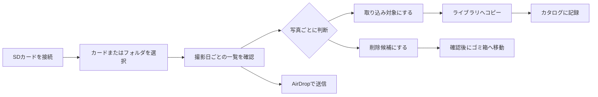
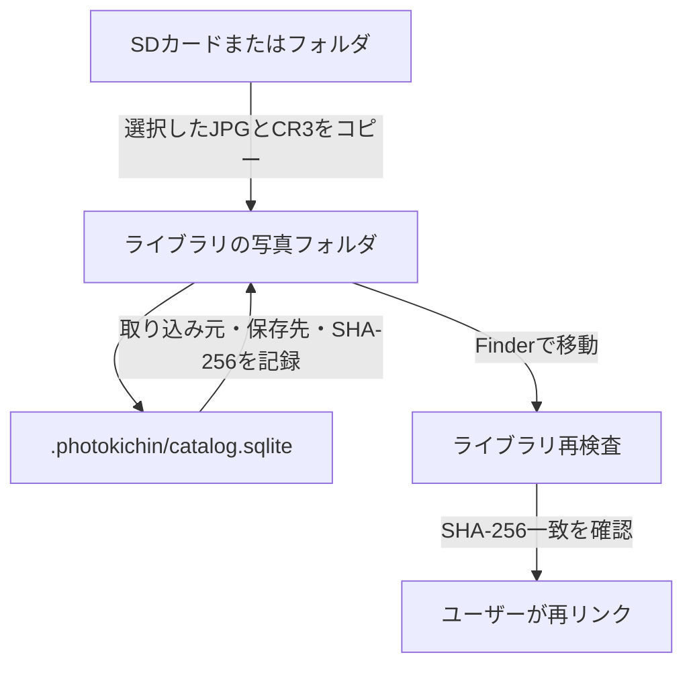

# Photokichin

Photokichin は、macOS で大量の写真、SD カード、USB 接続したカメラ内の写真を快適に確認し、選別して取り込むための写真管理アプリです。

カメラのカードを接続したら、まず写真を一覧で確認し、必要な写真だけをライブラリへコピーできます。写真を撮影日ごとに並べ、現在は JPG と CR3 を同じ撮影単位として扱うため、カードの中身を確認しながら取り込み対象を決められます。

現在は Canon EOS R の JPG／CR3 を中心に開発・検証しています。Sony を含む他メーカーのカメラにも対応する予定ですが、対応形式と動作確認の状況には差があります。詳しくは [対応形式とカメラ](#対応形式とカメラ) をご覧ください。

> この README は、現在のソースコードで確認できる機能を基準にしています。バージョン 0.1.0 の開発用未署名アプリであり、正式配布版ではありません。

## 目次

- [Photokichin について](#photokichin-について)
- [主な特徴](#主な特徴)
- [他の写真管理ソフトと異なる点](#他の写真管理ソフトと異なる点)
- [対応形式とカメラ](#対応形式とカメラ)
- [基本的な使い方](#基本的な使い方)
- [主な機能](#主な機能)
- [安全性に関する設計](#安全性に関する設計)
- [ライブラリとカタログ](#ライブラリとカタログ)
- [キーボード操作](#キーボード操作)
- [制限事項と今後の対応](#制限事項と今後の対応)
- [ビルドとテスト](#ビルドとテスト)
- [ライセンス](#ライセンス)

## Photokichin について

Photokichin は、写真をアプリの中へ取り込んだ後だけでなく、SD カード上にある写真を直接確認する場面を重視しています。

大量の写真を一度に読み込むときは、一覧に表示されている範囲のサムネイルとメタデータを優先して読み込みます。画面の前後にある写真も順番に先読みするため、カードを開いた直後や一覧をスクロールしているときでも、まず見たい写真から確認できます。

写真の閲覧、取り込み、AirDrop、削除候補の指定を一つの画面で行えます。ただし、写真をクリックしただけで取り込みや削除が実行されることはありません。閲覧中の写真を確認し、明示的に操作対象へ指定してから処理を実行します。

## 主な特徴

- SD カードまたは任意のフォルダを選択して写真を一覧表示できます。
- Finder にマウントされない USB カメラを ImageCaptureCore 経由で検出し、カメラ内の写真を直接一覧表示できます。
- 撮影日ごとに写真をまとめ、撮影日時の順に表示します。
- 同じフォルダで拡張子を除いたファイル名が同じ JPG と CR3 を、一つの撮影単位として表示します。
- 未取り込み、一部取り込み済み、取り込み済み、対象外などの状態を確認できます。
- サムネイルの大きさをスライダー、ピンチ操作、`⌘` と `+`／`-` で変更できます。
- 写真の撮影日時、カメラ、レンズ、焦点距離、絞り、シャッター速度、ISO 感度、GPS などのメタデータを表示できます。
- 写真を選択してライブラリへ取り込む、またはライブラリ間でコピーできます。
- SD カード、フォルダ、ライブラリの写真を、JPG＋CR3、JPG のみ、CR3 のみの三つの方法で AirDrop できます。
- ライブラリ内の写真にラベルを付け、複数のラベルで絞り込めます。
- Finder で写真を移動した場合に、カタログの問題として検出し、内容を確認して再リンクできます。
- カード上の写真を、確認後に macOS のゴミ箱へ移動できます。
- 読み込み中のカードを、処理が終わってから手動で安全に取り出せます。
- USB カメラから選択した JPG／CR3 をライブラリへ直接ダウンロードできます。カメラ内の削除は明示確認後に行い、対応しているカメラだけEjectできます。

## 他の写真管理ソフトと異なる点

Photokichin は、写真をアプリ独自の保管庫へ移すことだけを中心にするのではなく、カード上のファイルと Finder から見えるライブラリを確認しながら整理する使い方を重視しています。

| 観点 | Photokichin の考え方 |
| --- | --- |
| カードの確認 | 取り込み前の SD カードを、そのまま写真一覧として開いて確認します。 |
| JPG と CR3 | JPG と CR3 を別々の写真として扱わず、同じ撮影単位として取り込み・削除します。 |
| 取り込み | 必要な写真だけを選び、通常のフォルダにコピーします。取り込み先は Finder から確認できます。 |
| カタログ | カタログは写真そのものを格納する場所ではなく、取り込み履歴、ファイルの場所、検証情報、ラベルを記録する補助情報です。 |
| 削除 | 閲覧や選択だけでは削除されません。削除候補を指定し、確認画面で了承した場合だけゴミ箱へ移動します。 |
| 写真の扱い | 写真ファイルへアプリ独自のメタデータを書き戻さず、カメラのメタデータは読み取り専用で扱います。 |

この設計により、カードの写真を見ながら必要なものだけを取り込み、取り込み後も Finder から通常の写真ファイルとして扱えます。

## 対応形式とカメラ

### 現在の対応範囲

| 形式 | 現在の扱い | 確認状況 |
| --- | --- | --- |
| `.jpg` / `.jpeg` | 一覧表示、サムネイル、メタデータ表示、取り込み、AirDrop、ゴミ箱への移動 | 対象形式。カメラメーカーごとの実機確認は継続中です。 |
| `.cr3` | JPG と同じ撮影単位での表示、サムネイル、メタデータ表示、取り込み、AirDrop、ゴミ箱への移動 | Canon EOS R を主要な検証対象としています。 |
| `.mov` / `.mp4` | 写真一覧の探索時に検出します | 現在の取り込み、AirDrop、ラベル、ゴミ箱操作の対象外です。 |
| Canon の管理ファイル | 一覧に表示せず、読み書きしません | `CANONMSC` 以下を写真の探索対象から除外します。 |

### 他メーカーのカメラについて

フォルダを選択して開く機能は、指定したフォルダを探索する機能です。フォルダを選択しただけで、対応する RAW 形式が自動的に増えるわけではありません。

現行版のソースコードがファイル名の拡張子として認識する形式は、`.jpg`、`.jpeg`、`.cr3`、`.mov`、`.mp4` です。そのため、Sony の `.jpg`／`.jpeg` は対象形式として扱えますが、Sony の RAW 形式である `.arw` は現行版では一覧に表示されません。`.nef`、`.raf`、`.rw2`、`.orf`、`.dng` など、その他の RAW 形式も同様です。

JPG の標準的な EXIF 情報は macOS の ImageIO を使って読み取りますが、メーカーごとの RAW 形式やメーカー独自のメタデータには実機での確認が必要です。Sony を含む他メーカーの RAW 対応は今後の対応予定です。

## 基本的な使い方

### 1. 写真の場所を開く

1. SD カードを Mac に接続してマウントするか、カメラ本体を USB 接続します。
2. SD カードは「接続中のカード」から、USB カメラは「USBカメラ」から選びます。カードやカメラが一覧に出ない場合は、「フォルダを選択…」から写真の入ったフォルダを選べます。USB カメラの写真一覧を作成中でも、Photokichin の画面自体は操作できます。
3. ライブラリを作成する場合は、「ライブラリを追加・開く…」から保存先フォルダを選びます。

USB カメラは Finder のボリュームとしてではなく、macOS の ImageCaptureCore から読み取ります。そのため、Finder の `/Volumes` に表示されなくても、Photokichin の「USBカメラ」に表示される構成です。Canon EOS R5 Mark II 側では、USB 接続アプリの設定を画像取り込み用にしてください。ビデオ通話・ライブ配信用の設定では写真取り込み用デバイスとして認識されません。

カードやフォルダを開くと、写真は撮影日ごとに分けて表示されます。同じ撮影単位の JPG と CR3 がある場合は、同じサムネイルの中に形式が表示されます。USB カメラは写真一覧の作成が完了してから全件を表示し、その後のサムネイル読み込み・選択・閲覧はカードやライブラリと同じ表示優先度で処理します。見つかった順の部分一覧は表示しません。

### 2. 取り込み対象を指定する

写真をクリックすると、その写真にフォーカスが移ります。クリックだけでは取り込み対象になりません。

次のいずれかの方法で、取り込み対象を指定できます。

- 写真にフォーカスを移して `Return` を押す
- 写真の情報インスペクタにある取り込みボタンを押す
- 日付ごとの見出しにある「全選択」を使う
- 上部の「全選択」を使う
- 「範囲選択」を有効にして、ドラッグで複数の写真を囲む

取り込み対象と削除候補は同時には指定できません。すでに取り込み対象になっている写真を削除候補にすると、取り込み対象から外れます。

### 3. ライブラリへ取り込む

取り込み対象を指定したら、保存先ライブラリを選び、「ターゲットライブラリへ保存」を実行します。取り込み先のフォルダ名は、初期状態では次の形式です。

```text
YYYY-MM-DD_カメラ名/
```

取り込み画面では、`{date}` と `{camera}` を使ってフォルダ名の形式を変更できます。取り込み中は進捗が表示され、「中断」から処理を止められます。完了したファイルは保持され、次回はカタログの記録をもとに取り込み済みとして表示されます。

### 4. カードを整理する

不要な写真は、まず `Delete` で削除候補にします。内容を確認した後、ツールバーの「ゴミ箱」を押し、確認画面で「ゴミ箱へ移動」を選ぶと、選択した JPG と CR3 が macOS のゴミ箱へ移動します。

カードを取り出すときは、読み込みや取り込みが行われていないことを確認してから、ツールバーの「Eject」を押します。アプリは読み込み中の処理が残っている間は Eject を実行しません。USB カメラでは、削除候補にした写真を確認画面で確認してからカメラ側から削除します。EjectはImageCaptureCoreが対応能力を報告したカメラだけ表示・実行します。

基本的な操作の流れは次のとおりです。



## 主な機能

### 大量の写真を確認するための一覧

- 写真を撮影日ごとに分け、日付の見出しを固定して表示します。
- カードを開いた直後は、画面に見える範囲を優先して一覧を作ります。
- 表示中のサムネイルを優先し、画面の前後にある写真を先読みします。
- 取り込み状態を「未取り込み」「一部」「取り込み済み」「対象外」で表示します。
- 取り込み状態と操作状態を別々に絞り込めます。
- 取り込み済みの写真は、日付ごとの一覧で折りたたんで表示できます。

### 写真の確認と選択

- クリックでフォーカス、ダブルクリックで詳細ビューを開きます。
- 詳細ビューでは、写真を大きく表示し、撮影情報を確認できます。
- 矢印キー、Page Up、Page Down、Home、End で一覧を移動できます。
- `Return` で取り込み対象、`Delete` で削除候補を切り替えます。
- Command キーを押しながらのクリック、Shift キーを押しながらのクリック、範囲選択で複数の写真にフォーカスできます。
- 選択した写真の枚数と削除候補の枚数を一覧上部で確認できます。

### メタデータとサムネイル

macOS の ImageIO を使い、対応するファイルから次の情報を読み取ります。

- 撮影日時
- カメラのメーカーとモデル
- レンズ
- 焦点距離
- 絞り
- シャッター速度
- ISO 感度
- 露出補正
- 写真の向き
- GPS 情報
- ファームウェア情報
- 画像の解像度

カード上のファイルを読むときは、読み込み処理の間にカードが取り外されても ImageIO がカードへアクセスし続けないよう、読み込み単位を管理しています。

### 取り込みとライブラリ間コピー

SD カードやフォルダからライブラリへ取り込むときは、選択した撮影単位に含まれる JPG と CR3 をまとめて処理します。

USB カメラからの取り込みでは、ImageCaptureCore のダウンロード機能で選択した JPG／CR3 をライブラリ内の不可視の仮ファイルへ直接取得し、サイズと SHA-256 を検証してから同じディレクトリ内で正式なファイル名へ変更します。サムネイル表示だけでは元ファイル全体をダウンロードしません。

USB カメラからの削除では、選択したすべてのJPG／CR3を一度だけ確認します。`CanDeleteOneFile`を報告したカメラに対して、確認後に各ファイルへ個別の削除要求を順番に送ります。全ファイル削除能力は使用しません。失敗したファイルがあれば、失敗内容を表示します。

- SD カードからの取り込みでは、一時ファイルへコピーしてから SHA-256 で内容を検証します。
- 検証が完了したファイルだけを取り込み済みとしてカタログへ記録します。
- カメラ側の作成日時と変更日時を保存先へ復元します。
- 同じ内容のファイルが保存先に存在する場合は、重複コピーを避けます。
- 内容の異なる同名ファイルがある場合は、上書きせずにエラーとして知らせます。
- 同じ Mac 上のライブラリ間コピーでは、利用できる場合に APFS のクローンを使います。
- ライブラリ間コピーでは、ラベルをコピーするかどうかを選べます。初期状態では有効です。

### ラベルと保存ビュー

ラベルは、取り込み済みの写真、またはライブラリへ明示的に登録した写真に付けられます。JPG と CR3 がある場合は、ファイルごとではなく撮影単位にラベルを付けます。

- ラベルの数に制限は設けていません。
- ラベルの名前、色、並び順を変更できます。
- ラベルを統合したり、削除したりできます。
- 複数のラベルを指定した場合は、指定したすべてのラベルが付いた写真だけを表示します。
- よく使うラベルの組み合わせを保存ビューとして登録できます。
- 保存ビューはライブラリ間コピーの対象外です。
- ラベルのコピーを無効にした場合、コピー先のラベル情報は変更しません。

現行版のラベル検索は AND 条件に対応しています。OR 条件と NOT 条件には対応していません。

### AirDrop

SD カード、任意のフォルダ、またはライブラリを開いて選択した写真を、次の三つの方法で AirDrop できます。ライブラリの写真は、ライブラリ内にある実ファイルを送信します。

| モード | 送信するファイル |
| --- | --- |
| JPG＋CR3 | JPG と CR3 の両方 |
| JPG のみ | JPG のみ |
| CR3 のみ | CR3 のみ |

JPG＋CR3 を送信した場合に、受信側の写真アプリが必ず一枚の写真へまとめることは、Photokichin からは保証できません。

### カタログ管理

ライブラリを Finder から操作した場合も、カタログ管理画面から状態を確認できます。

- ライブラリを再検査する
- Finder から置かれた未登録の写真を、確認したうえで登録する
- 移動・削除された写真の問題を確認する
- SHA-256 が一致する候補を探して、手動で再リンクする
- 元のカードやフォルダから写真を再コピーする
- カタログの履歴だけを削除する
- SQLite の整合性とファイル内容を完全検査する
- SQLite と WAL を含むカタログをバックアップする
- カタログフォルダを Finder で開く

履歴を削除しても、写真ファイルそのものは削除しません。

## 安全性に関する設計

写真カードを扱うため、次の境界を設けています。

- Canon の `CANONMSC` 以下にある管理ファイルなどを、写真として一覧に表示しません。
- カメラの管理ファイルや、カード上の写真のメタデータを書き換えません。
- カード上の写真を変更する操作は、ユーザーが削除候補を指定し、確認画面で了承した後のゴミ箱への移動だけです。
- JPG と CR3 は、取り込みと削除の単位を分けません。片方だけを誤って処理しないようにします。
- 取り込みでは一時ファイルと内容検証を使い、検証前のファイルを取り込み済みとして記録しません。
- 取り込み中や読み込み中は、保存先の切り替えや Eject を実行できません。
- Eject は自動では実行せず、ユーザーがツールバーから明示的に実行します。
- USB カメラの削除は、削除候補を作成した後の明示確認を必須とし、`CanDeleteOneFile`とロック状態を確認してから実行します。EjectはImageCaptureCoreの対応能力と処理停止を確認してから実行します。

カードの保護状態や、カードの故障・接触不良などをアプリが判定することはできません。重要な写真は、別の場所へのコピーとバックアップを確認してからカードを整理してください。

## ライブラリとカタログ

Photokichin のライブラリは、通常のフォルダに写真を保存します。写真そのものを SQLite データベースへ格納する方式ではありません。

```text
ライブラリ/
├── 2026-08-13_Canon EOS R/
│   ├── IMG_0001.JPG
│   └── IMG_0001.CR3
├── 2026-08-14_Canon EOS R/
│   └── IMG_0042.JPG
└── .photokichin/
    └── catalog.sqlite
```

`.photokichin/catalog.sqlite` には、取り込み元と保存先の対応、ファイル形式、SHA-256、ファイルサイズ、ラベルなどを記録します。カタログは写真の保管場所ではなく、写真を見つけて取り込み状態を管理するための索引です。



Finder で取り込み済みの写真を移動または削除した場合、履歴をすぐに消すのではなく、カタログ管理画面に問題として残します。同じ名前・同じサイズの候補を探した後、最終的には SHA-256 が一致した候補だけをユーザーが確認して再リンクできます。再リンクは写真をコピーせず、カタログの保存先だけを更新します。

## キーボード操作

| 操作 | 動作 |
| --- | --- |
| クリック | 写真にフォーカスを移します。 |
| ダブルクリック | 詳細ビューを開きます。 |
| 矢印キー | グリッド上の隣接写真へ移動します。 |
| Page Up／Page Down | 一画面分ずつ移動します。 |
| Home／End | 一覧の先頭または末尾へ移動します。 |
| `Return` | フォーカス中の写真を取り込み対象にします。 |
| `Delete` | フォーカス中の写真を削除候補にします。 |
| `Space` | 詳細ビューを開閉します。 |
| `L` | ラベル設定を開きます。ライブラリ表示時に使用できます。 |
| `⌘` と `+`／`-` | サムネイルを拡大・縮小します。 |
| Command キーを押しながらクリック | 複数の写真にフォーカスします。 |
| Shift キーを押しながらクリック | 範囲内の写真にフォーカスします。 |

## 制限事項と今後の対応

- 対応 OS は macOS 26 以上です。
- 現在は Canon EOS R の JPG／CR3 を中心に実機確認しています。
- USB カメラは macOS の ImageCaptureCore が写真取り込みデバイスとして認識した機種を対象にしています。EOS R5 Mark II は画像一覧とサムネイルを実機確認済みで、カメラ内削除は `CanDeleteOneFile` とロック状態を確認してから実行します。
- Sony の RAW（`.arw`）を含む他メーカーの RAW 形式は、現行版の一覧探索対象外です。
- `.mov` と `.mp4` は一覧探索時に検出しますが、現在の取り込み、AirDrop、ラベル、ゴミ箱操作の対象外です。
- AirDrop 後の受信側アプリによる JPG と CR3 の統合は保証しません。
- 現在の配布物は開発用の未署名アプリです。初回起動時の macOS の警告や、正式なインストーラーは今後整備します。

## ビルドとテスト

### 必要な環境

- macOS 26 以上
- macOS に含まれる Swift コンパイラ
- `/bin/zsh`

Xcode プロジェクトは使用せず、リポジトリ内のスクリプトからビルドします。

現在のアプリは、SD カードの自動検出、ImageCaptureCore による USB カメラの検出、カード上のファイル一覧、明示的に確認した写真のゴミ箱への移動、確認後のカメラ内ファイル削除、安全な Eject を扱うため、非サンドボックス方式で動作します。

### アプリをビルドする

```sh
./build.sh
open build/Photokichin.app
```

`build.sh` は SwiftUI、AppKit、ImageIO、ImageCaptureCore、Disk Arbitration、UniformTypeIdentifiers、SQLite3 を使ってアプリをビルドし、開発用の署名を付けた `build/Photokichin.app` を作成します。

### テストを実行する

```sh
./run-tests.sh
```

テストでは、写真の取り込み状態、撮影日ごとの並び、キーボード移動、カタログ検査、Finder 移動後の再リンク、ライブラリ間コピー、ラベルのコピー、ファイル属性の保持などを確認します。

`/Volumes/EOS_DIGITAL` に EOS R のカードがマウントされている場合は、カード上の JPG／CR3、ImageIO のメタデータ、Canon 管理ファイルの除外、取り込み処理も検証します。カードがマウントされていない場合、この実機テストはスキップされます。

## ライセンス

ソースコードは MIT License で公開します。詳細は [LICENSE](LICENSE) をご覧ください。

## リポジトリ

GitHub: [github.com/yappo/Photokichin](https://github.com/yappo/Photokichin)
